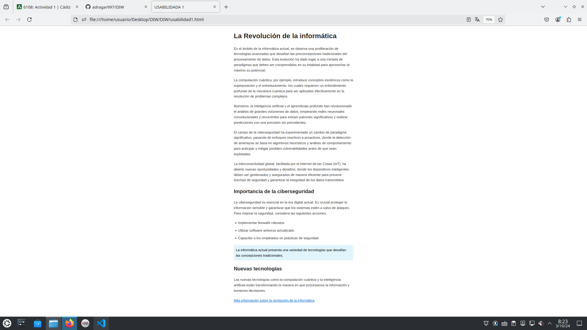
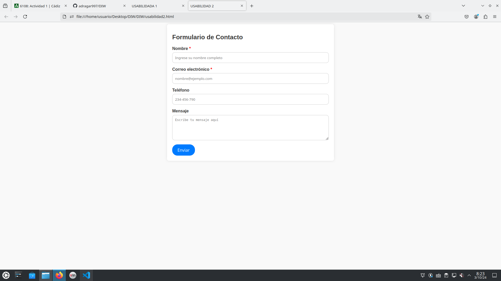
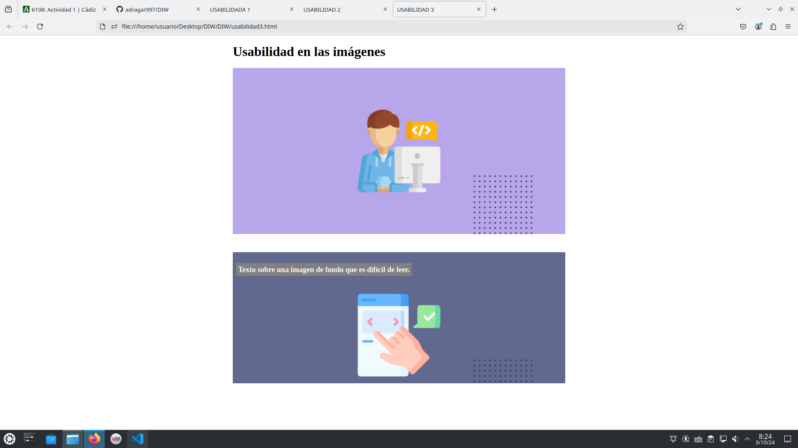
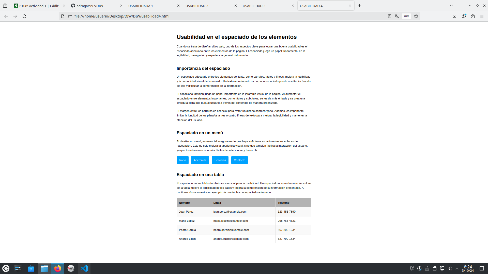

# ACTIVIDAD 1 - TEMA 2

## USABILIDAD 1
- Nombre del enlace cambiado para mejor visibilidad.
- Aumento en el tamaño de los párrafos.
- Mejor espaciado entre párrafos y cabeceras.
- Uso de listas para una visión de los datos más clara.
- uso de una fuente distinta.
- Mejora en la legibilidad entre el fondo y el texto.

## USABILIDAD 2
- Uso de placeholder para añadir una ayuda extra al usuario.
- Hay una comprobación en tiempo real de los campos.
- Se ha simplificado el diseño para una mejor visualización del contenido.
- Un boton destacado para el envío del formulario.

## USABILIDAD 3
- Se ha ajustado la imagen junto a la otra que tenemos.
- Se ha añadido una etiqueta alt descriptiva a la primera imagen.
- Se ha ajustado el contraste con la segunda imagen para poder ver el texto en ella mejor.

## USABILIDAD 4
- Tamaño de la tabla ajustado para poder leer los datos correctamente.
- Contraste en la tabla para destacar las cabeceras.
- Color mejorado en los botones de navegación.
- Se ha aumentado el margen de todas las cabeceras para una lectura más cómoda.

